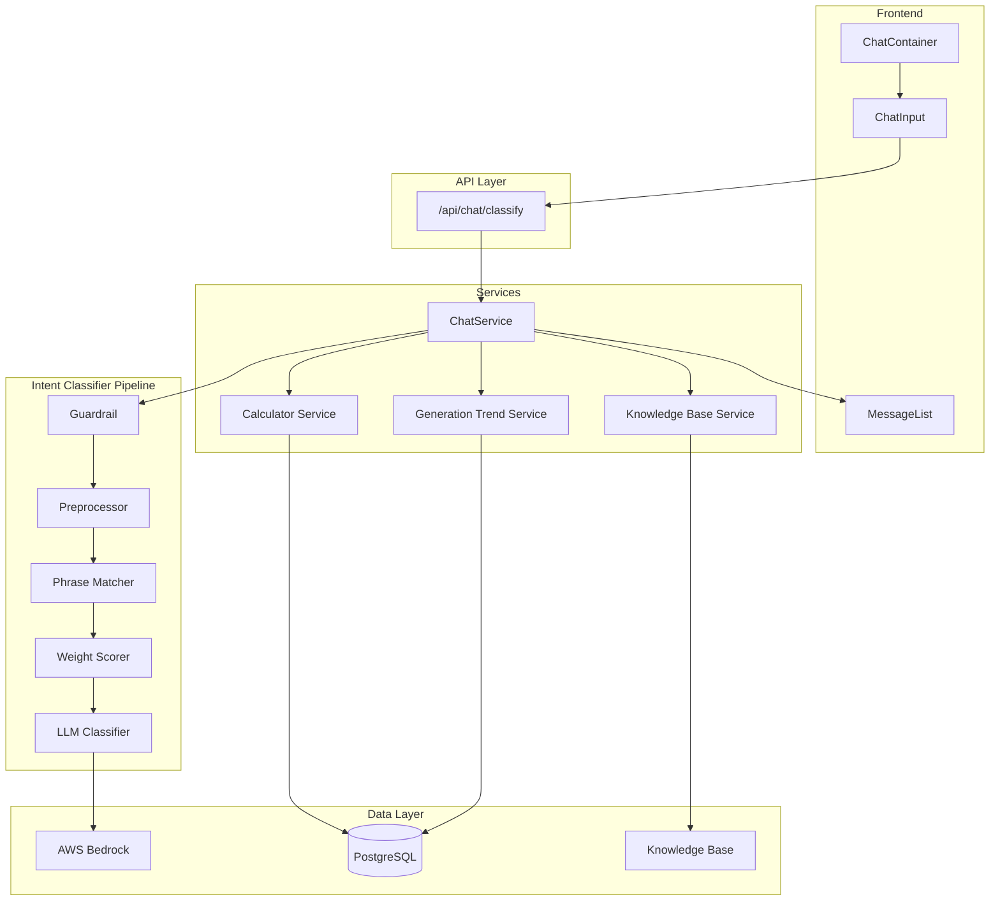
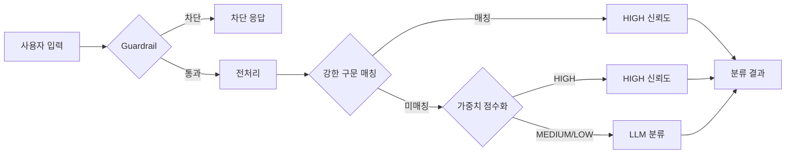

# Solar Insight

태양광 발전량 분석 및 수익 계산 AI 챗봇 서비스

## 주요 기능

- **발전량 추이 조회**: 광역시도/시군구별 시간별, 일별, 주별, 월별, 계절별, 연도별 발전량 조회
- **수익 계산**: 설비 용량 기반 SMP/REC 수익 계산 (정방향/역방향)
- **RAG 기반 Q&A**: AWS Bedrock Knowledge Base를 활용한 태양광 관련 질의응답

## 시스템 아키텍처



## 의도 분류 파이프라인



## 데이터 소스

| 데이터          | 소스                                | 기간              | 레코드 수                    |
| --------------- | ----------------------------------- | ----------------- | ---------------------------- |
| 광역시도 발전량 | 공공데이터포털 API (한국전력거래소) | 2022.01 ~ 2026.01 | 414,936건                    |
| 일사량 (GHI)    | NASA POWER API                      | 2019.01 ~ 2026.02 | 13,438,002건                 |
| SMP 시간별      | 전력거래소 CSV                      | 2001.05 ~ 2026.01 | 357,456건                    |
| SMP 일별        | 전력거래소 CSV                      | 2001.05 ~ 2026.01 | 14,894건                     |
| SMP 월별        | 전력거래소 CSV                      | 2001.04 ~ 2025.11 | 296건                        |
| 지역 마스터     | 하드코딩                            | -                 | 224개 (시도 17 + 시군구 207) |
| 집계 데이터     | 자동 생성                           | -                 | 21,613건                     |

## 핵심 계산 공식

### 1. 수익 계산 (정방향)

```
연간 발전량(kWh) = 용량(kW) × 24시간 × 이용률 × 365일
월간 발전량(kWh) = 연간 발전량 ÷ 12
일간 발전량(kWh) = 연간 발전량 ÷ 365

SMP 수익(원) = 발전량(kWh) × SMP 단가(원/kWh)
REC 수익(원) = (발전량(kWh) ÷ 1000) × REC 가중치 × REC 단가(원)
총 수익 = SMP 수익 + REC 수익

kWh당 통합단가 = SMP단가 + (REC단가 × REC가중치 ÷ 1000)
```

### 2. 필요 용량 역산 (역방향)

```
필요 용량(kW) = 연간 목표 수익 ÷ (24 × 이용률 × 365 × kWh당 통합단가)
```

### 3. 시군구 발전량 추정

```
시군구 발전량 = 상위 광역시도 발전량 × (시군구 일사량 ÷ 광역시도 전체 일사량)
```

### 기본값

| 파라미터   | 기본값                             | 비고             |
| ---------- | ---------------------------------- | ---------------- |
| 이용률     | 15%                                | 태양광 평균      |
| REC 가중치 | 1.2 (100kW 미만), 1.0 (100kW 이상) | 용량별 자동 판단 |
| SMP 단가   | DB 최신값 또는 110원/kWh           | 폴백             |
| REC 단가   | API 최신값 또는 70,000원           | 폴백             |

## 데이터 파이프라인

```
seed-regions → collect-generation → collect-irradiance → estimate-cities → aggregate
```

1. **seed-regions**: 17개 시도 + 207개 시군구 지역 마스터 초기화
2. **collect-generation**: 공공데이터포털에서 광역시도 시간별 발전량 수집
3. **collect-irradiance**: NASA POWER API에서 시간별 일사량(GHI) 수집
4. **estimate-cities**: 광역시도 발전량 × 일사량 비율로 시군구 발전량 추정
5. **aggregate**: 시간별 → 일별 → 주별 → 월별 집계

## 기술 스택

- **Frontend**: Next.js 16, React 19, Tailwind CSS, Recharts
- **Backend**: Next.js API Routes, Prisma ORM
- **Database**: PostgreSQL
- **AI/ML**: AWS Bedrock (Claude), Knowledge Base (RAG)

## 프로젝트 구조

```
solor-insight/
├── src/
│   ├── app/                    # Next.js App Router
│   │   ├── (dashboard)/        # 대시보드 레이아웃
│   │   │   └── chat/           # 채팅 페이지
│   │   └── api/                # API Routes
│   │       ├── chat/           # 채팅 API
│   │       └── health/         # 헬스체크
│   ├── components/             # React 컴포넌트
│   │   ├── chat/               # 채팅 관련 컴포넌트
│   │   │   ├── ChatContainer/
│   │   │   ├── ChatInput/
│   │   │   ├── GenerationTrendReport/
│   │   │   ├── MessageBubble/
│   │   │   ├── MessageList/
│   │   │   ├── RevenueReport/
│   │   │   └── ReverseReport/
│   │   └── common/             # 공통 컴포넌트
│   ├── constants/              # 상수 정의
│   │   ├── chat/               # 채팅 관련 상수
│   │   └── regions.ts          # 지역 데이터
│   ├── contexts/               # React Context
│   ├── hooks/                  # Custom Hooks
│   └── lib/                    # 비즈니스 로직
│       ├── api/                # 외부 API 클라이언트
│       ├── bedrock/            # AWS Bedrock 클라이언트
│       ├── chat/               # 채팅 처리 로직
│       │   ├── intent-classifier.ts
│       │   ├── guardrail.ts
│       │   ├── calculators.ts
│       │   └── ...
│       ├── db/                 # 데이터베이스 쿼리
│       ├── llm/                # LLM 멀티스텝 프롬프팅
│       │   └── steps/generation-trend/
│       ├── services/           # 서비스 레이어
│       │   ├── chat.ts
│       │   ├── calculator.ts
│       │   ├── generation-trend.ts
│       │   └── knowledge-base.ts
│       ├── utils/              # 유틸리티
│       └── validations/        # 검증 로직
├── scripts/                    # 데이터 수집/처리 스크립트
│   ├── aggregate.ts            # 발전량 집계
│   ├── collect-generation.ts   # 발전량 수집
│   ├── collect-irradiance-nasa.ts  # 일사량 수집
│   ├── estimate-cities.ts      # 시군구 추정
│   ├── seed-regions.ts         # 지역 시드
│   └── deploy/                 # 배포 스크립트
├── prisma/
│   ├── schema.prisma           # DB 스키마
│   ├── seed.ts                 # SMP 시드
│   └── data/                   # CSV 데이터
└── nginx/                      # Nginx 설정
```

## 환경 변수

```bash
# .env.example 참조
DATABASE_URL="postgresql://..."

# AWS Bedrock
AWS_REGION="ap-northeast-2"
AWS_ACCESS_KEY_ID="..."
AWS_SECRET_ACCESS_KEY="..."
BEDROCK_KNOWLEDGE_BASE_ID="..."

# 공공데이터포털 API
DATA_GO_KR_API_KEY="..."
```

## 실행 방법

### 개발 환경

```bash
# 의존성 설치
npm install

# DB 마이그레이션
npm run db:migrate

# 지역 시드
npm run seed:regions

# SMP 시드
npm run db:seed

# 개발 서버 실행
npm run dev
```

### 데이터 수집

```bash
# 발전량 수집 (공공데이터포털)
npm run collect:generation

# 일사량 수집 (NASA POWER)
npm run collect:irradiance
npm run collect:irradiance 2024      # 특정 연도
npm run collect:irradiance 2019 2025 # 연도 범위

# 시군구 추정
npm run estimate:cities

# 집계
npm run aggregate
```

### 프로덕션 배포

```bash
# 빌드
npm run build

# 프로덕션 실행
npm start
```

## 라이선스

Private
